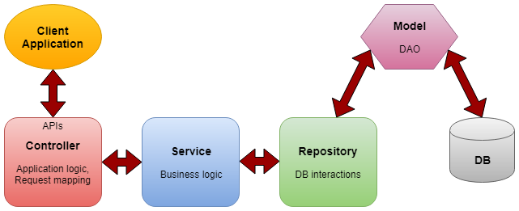
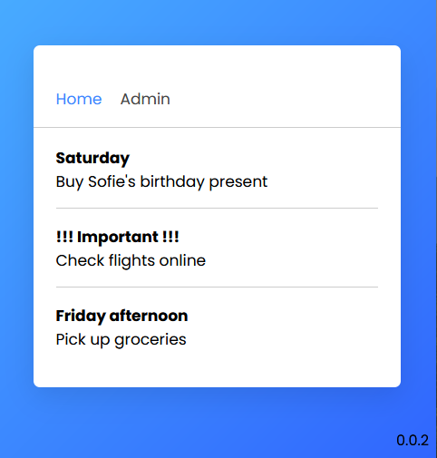
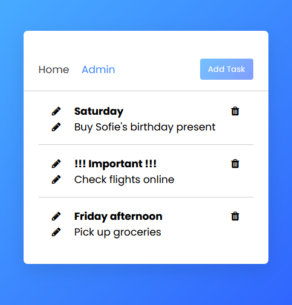

# Spring Boot Course 2022

## Building a Simple Application with Spring Boot

### Running this project

Create with eclipse a new java spring project and execute the directories copied in the project as java application, running the main class of the project.

### Controller-Service-Repository Architecture

* Controller - Contains application logic, mapping the user request to particular functions and passing the user input to service layer to apply the business logic.
* Service - Layer between the controller and repository which performs the business logic and validation logic.
* Repository - The layer which interact with the database CRUD operations via the DAOs (data access objects).
* Model - Is the simple classes which is acting as the DTO(Interact with application level data transfer) or DAO(Interaction with database operations).

### The project

The project is composed in two parts: the main view read-only and the admin view where the user is able to set the content of the database.

### Topics covered on this project

- Spring Boot

- Spring MVC

- Spring Data JPA

### Author

Carlo Tacchella

### Creation Date

 22/09/07
 